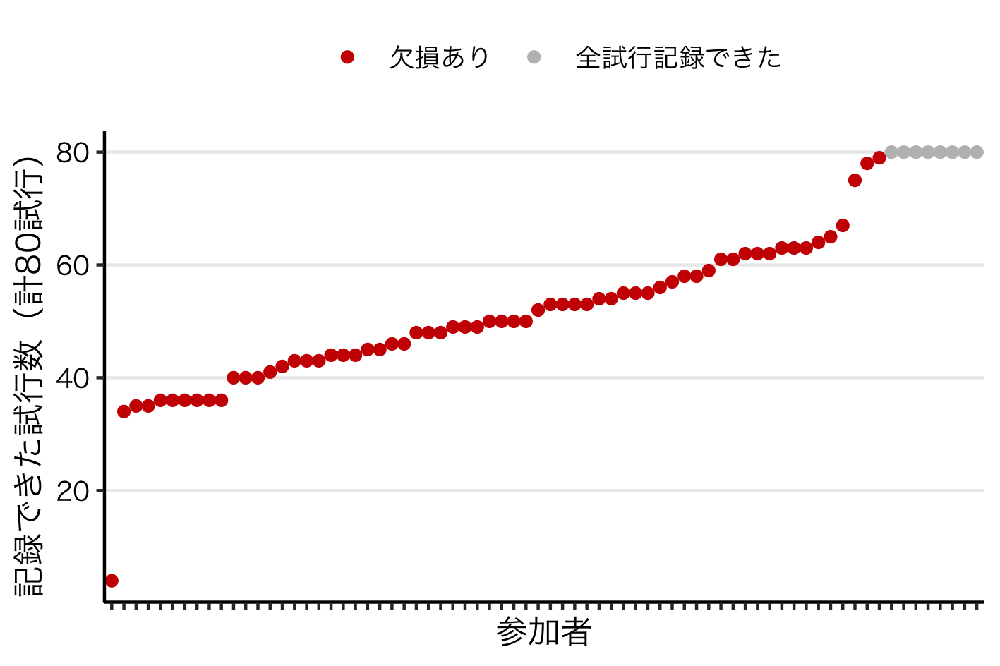

{}

<br>

# この記事のサマリー

- jsPsychとFirebaseでウェブ実験を実施した

- 私の浅知恵のせいで、データが十分に記録されないという悲劇が生じた

- 結局のところ、[国里先生の記事](https://kunisatolab.github.io/main/how-to-jspsych-firebase.html "jsPsychを用いたWEB実験の実施：Firebaseでホスティング&データ保存しよう！")や[安藤先生の記事](https://ando-roid.hatenablog.com/entry/intro_psyexp_R "「Rで始める心理学Web実験」を書いた話")を忠実に守れば悲劇なんて起こらないということがわかった

<br>

# 自己紹介

[Online Psychological Experiment Advent Calendar](https://adventar.org/calendars/6005 "Online Psychological Experiment Advent Calendar") の21日目に登録した黒田起吏と申します。社会情報の処理過程や集団意思決定時の認知過程について、主に実験室実験（ヒトを対象とした認知行動実験）を用いて研究してきました。

先日、jsPsychとFirebaseを用いたウェブ実験を行ったところ、大きなミスを犯しました。この記事ではその経緯と原因を説明します。反面教師にしていただければ幸いです。

<br>

# ウェブ実験の背景

COVID-19の影響で、ヒトを対象とした実験室実験を実施しにくくなっています。近頃では、[共用のキーボードからコロナに感染した話](https://www.yomiuri.co.jp/national/20201207-OYT1T50081/ "同じ端末のキーボード共有、クラスター原因か…ボタンに「高さ」あるタイプ")もあるそうです。この状況では、協力してくださる方々が安心して実験に参加できるとは思えないため、いまは実験室実験を自粛しています。

そのため今年度から、私はjsPsychとFirebaseを用いてウェブ実験を行ってきました。実施方法については、[国里先生の記事](https://kunisatolab.github.io/main/how-to-jspsych-firebase.html "jsPsychを用いたWEB実験の実施：Firebaseでホスティング&データ保存しよう！")や[安藤先生の記事](https://ando-roid.hatenablog.com/entry/intro_psyexp_R "「Rで始める心理学Web実験」を書いた話")をご覧ください。

<b><u>結論としては、2つの記事の内容を忠実に守ればトラブルは起きません。</b></u>しかし、私は浅知恵を働かせてしまい、記事の内容を忠実には守りませんでした。結局のところ、それが悲劇の原因でした。[^1]

<br>

# 悲劇の経緯

2020年12月14日、ウェブ実験の参加者をメールで募集しました。このウェブ実験は「参加希望者がURLからサイトにアクセスし、自分のペースで80試行の課題に取り組む」というシンプルなものです。サンプルサイズについては、63名を計画していました。

しばらくして、70名程度（脱落者や外れ値がいるかもしれないと考えていたので、63名より若干多めに実施）のデータが集まりました。FirebaseからJSONデータをエクスポートし、データが記録されているかを確認しました。

すると、下の図のような結果が得られました。X軸は各参加者、Y軸は記録できた試行数を表しています。




OMG。<u>**全80試行を記録できた人が、たった8人しかいません。残り60数名では、大なり小なり欠損が生じてしまっています。**</u>なぜこのようなことが起きてしまったのでしょうか？

<br>

# 悲劇の原因と解決策

結論から言うと、Firebaseへのデータの記録方法が間違っていたのが原因でした。まず、正解（[国里先生の記事](https://kunisatolab.github.io/main/how-to-jspsych-firebase.html "jsPsychを用いたWEB実験の実施：Firebaseでホスティング&データ保存しよう！")や[安藤先生の記事](https://ando-roid.hatenablog.com/entry/intro_psyexp_R "「Rで始める心理学Web実験」を書いた話")で紹介されている方法）を見ていきます。

<br>

## 正解

正解のやり方では、以下のようなコードでデータを記録します。

```js
jsPsych.init({
  timeline: timeline,
  on_finish: function() {
    firebase.database().ref(exp_id).set({
      data: jsPsych.data.get().values()
    })
  }
});
```

これが意味しているのは「**<u>実験が全て終わったら、これまでのデータを一括で記録する</u>**」ということです。こうしておけば、データはきちんと記録されます。

<br>

## 不正解（今回やってしまったこと）

しかし、私は浅知恵を働かせてしまいました。どのような浅知恵だったかを説明します。

まず、[国里先生の記事](https://kunisatolab.github.io/main/how-to-jspsych-firebase.html "jsPsychを用いたWEB実験の実施：Firebaseでホスティング&データ保存しよう！")や[安藤先生の記事](https://ando-roid.hatenablog.com/entry/intro_psyexp_R "「Rで始める心理学Web実験」を書いた話")を読んだとき、素朴にこう思いました。

<br>

> この方法（正解バージョン）だと、実験の途中で参加者が脱落したら、データを記録できないのでは？？？

<br>

実際、この考え自体は正しいです（おそらくは。でもあまり自信ないです）。そこで私は「**<u>各試行が終わるたびにデータを記録</u>**」するようにしました。下のようなコードです。

```js
// 以下のコードは不正解なので真似しないでください!!

// 80試行のタイムライン。
// 各試行の最後（参加者の反応後）にこれまでの全てのデータを逐一記録
const timeline = {
  timeline: [fixation, stimulus, response],
  timeline_variables: variables, // 80試行のパラメタ
	repetitions: 1,
  on_finish: function() {
    firebase.database().ref(exp_id).set({
      data: jsPsych.data.get().values()
    })
  }
};

// 実験の最後にもついでにデータを記録
jsPsych.init({
  timeline: timeline,
  on_finish: function() {
    firebase.database().ref(exp_id).set({
      data: jsPsych.data.get().values()
    })
  }
});
```

実際、このコードは動くし、データも記録できます。

ただしそれは、1人ないし少人数が同時に取り組んでいる場合だけです。<u>**つまり、自分1人でテストする限り、このコードが不具合を起こすことはほとんどありません。しかし、複数人が同時にこの課題に取り組むと、データの欠損が生じてしまいます。**</u>

<br>

## 何が起きていたか？

データの欠損に気がついたとき、私は以下の3つが原因かもしれないと考えました。

1. Firebaseが無料プランだった（しょぼかった）
2. 同時に参加した人数が多く、それがサーバに負荷をかけた
3. データを毎試行（頻繁に）記録して、それがサーバに負荷をかけた

<br>

まず1についてです。Firebaseに詳しくないので確かなことは言えませんが「課金すればいいんじゃないの」と思い、早速自分のクレジットカードを登録しました。つまり1の原因は（おそらく）潰せました。

次に2についてです。同時接続数を確認したところ、最大12人が同時接続していたことがわかりました。12人が同時接続するだけでサーバが駄目になるサービスだとしたら、Firebaseの商売は成り立ってないはずなので、この可能性はかなり低いと考えました。ただ、一応その可能性は切り捨てませんでした。

残った最後の可能性として、3の原因が一番大きそうだと考えるに至りました。これまで私は「毎試行データを記録するぐらい、Firebaseサンなら大丈夫でしょ」と思っていましたが、そうではないかもしれないと考え直したということです。

<br>

# テスト

## テスト状況

上の説を検証するため、12月16日にテストを行いました。テスト状況は以下のとおりです。

- Firebaseのプランをアップグレードした
- 実験データを「実験の最後に一括で記録」するようにした。つまり、国里先生や安藤先生のやり方に忠実に従ったということ
- 13人（研究室のメンバーなど）に頼み、同時にウェブサイトに接続して課題に取り組んでもらった

<br>

## 結果

記録されたデータを確認したところ、13人全員のデータ全てが記録されていました。つまり成功です。

<br>

## 考察

コードを正解バージョンに修正したことがかなり有効だったと考えられます。もちろんFirebaseのアップグレードが有効だったという可能性は残っていますが、とにかくデータ欠損の問題は解決しました。

<br>

# 教訓

まとめると、jsPsychとFirebaseで実験を実施するときは、

1. [国里先生の記事](https://kunisatolab.github.io/main/how-to-jspsych-firebase.html "jsPsychを用いたWEB実験の実施：Firebaseでホスティング&データ保存しよう！")や[安藤先生の記事](https://ando-roid.hatenablog.com/entry/intro_psyexp_R "「Rで始める心理学Web実験」を書いた話")にあるように「実験が全て終わったときにデータを記録する」のが良い
2. （インテンシブに）データを取る場合、Firebaseは一応有料プランにしておくのが良いかもしれない。無料枠の中で済んだらどうせお金を払わずに済むので（おそらくは。詳しくはご自身の責任でお調べください）

ということになります。

私のようにやらかす人は少ないとは思いますが、念のためご注意いただければと思います。


[^1]:  [『文化がヒトを進化させた』の書評](https://shorebird.hatenablog.com/entry/2020/01/11/113010 "『文化がヒトを進化させた』の書評")にもあるように、まさに「累積的に進化した文化のコンテンツは個人の体験や思考の限界を超えて有用なことが多いからなぜそうするのかわからなくてもまず従うことが有利」ということでした。つまり「よくわからんけど、とりあえず言い伝えには従っておく」が正解だったということです。